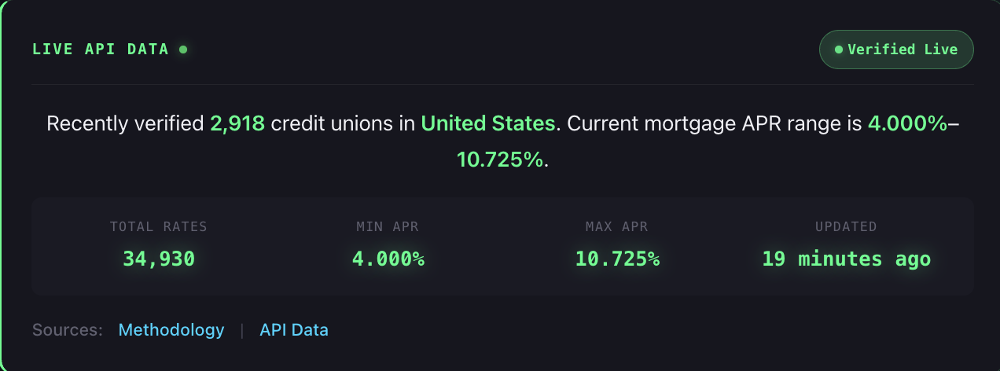

# RateAPI Demos

<p align="center">
  <b>2,900+ credit union mortgage rates. One API call.</b>
</p>

<p align="center">
  
</p>

<p align="center">
  <a href="#-pick-your-demo">Pick a Demo</a> •
  <a href="#-demo-details">Demo Details</a> •
  <a href="https://rateapi.dev">Documentation</a>
</p>

---


[](https://api.rateapi.dev)

```bash
git clone https://github.com/holdequity/rateapi-demos.git
cd rateapi-demos
node run.js rate-explorer  # Auto-creates API key, shows live rates
```

---

## 🎯 Pick Your Demo

| Demo | Best For | Run Time |
|------|----------|----------|
| [**Rate Explorer**](#-1-rate-explorer) | See the API in action | 30 sec |
| [**Webhook Monitor**](#-2-webhook-monitor) | Build rate alerts | 2 min |
| [**AI Agent**](#-3-ai-agent) | Add to chatbots/assistants | 1 min |
| [**React Widget**](#-4-react-widget) | Embed in React apps | 5 min |
| [**LangChain Agent**](#-5-langchain-agent) | Build AI mortgage advisors | 10 min |

### API Coverage by Demo

|  | Rate Explorer | Webhook Monitor | AI Agent | React Widget | LangChain |
|--|:--:|:--:|:--:|:--:|:--:|
| API Key Creation | ✓ | | | | |
| Decision Engine | ✓ | ✓ | ✓ | ✓ | ✓ |
| Credit Union Lookup | ✓ | | ✓ | | ✓ |
| Monitor CRUD | | ✓ | | | |
| Webhook Verification | | ✓ | | | |
| LLM Tool Integration | | | ✓ | | ✓ |
| React Hooks | | | | ✓ | |

**Start with Rate Explorer** — it auto-creates an API key the other demos will use.

---

## 📖 Demo Details

### 🔍 1. Rate Explorer

**Find the best mortgage rates in seconds.** Zero dependencies, just Node.js.

```bash
node run.js rate-explorer
```

**What you'll learn:**
- Self-service API key creation (`POST /keys`)
- Decision engine (`POST /v1/decisions`)
- Credit union lookups (`GET /credit-unions/{state}/{slug}`)

[View source →](./rate-explorer/)

---

### 🔔 2. Webhook Monitor

**Get alerts when mortgage rates drop.** Production-ready webhook verification included.

```bash
cd rate-monitor && npm install
node server.js
```

**What you'll learn:**
- Creating rate monitors with conditions
- HMAC-SHA256 signature verification
- Monitor lifecycle (create, list, delete)

[View source →](./rate-monitor/)

---

### 🤖 3. AI Agent

**Chat-based mortgage advisor.** Works without OpenAI key (mock mode).

```bash
node run.js rate-agent          # Mock mode
node run.js rate-agent --real   # GPT-4 mode (needs OPENAI_API_KEY)
```

**What you'll learn:**
- LLM function/tool calling
- Natural language → API queries
- Testing AI integrations without API costs

[View source →](./rate-agent/)

---

### 📊 4. React Widget

**Embeddable rate comparison widget.** Light/dark themes, TypeScript support.

```bash
cd react-rate-widget && npm install
RATEAPI_KEY=your-key npm start
```

**What you'll learn:**
- React integration patterns
- Custom hooks (`useRateAPI`)
- Server-side API key protection

[View source →](./react-rate-widget/)

---

### 🧠 5. LangChain Agent

**Full mortgage advisor with LangChain.** CLI and web interface.

```bash
cd langchain-mortgage-agent && npm install
npm run chat      # CLI
npm run web       # Web UI at localhost:3000
```

**What you'll learn:**
- LangChain agent architecture
- Multi-tool orchestration
- Conversational AI patterns

[View source →](./langchain-mortgage-agent/)

---

## ⚙️ Setup

All demos share a `.env` file in the root:

```
RATEAPI_KEY=your-key        # Auto-created by Rate Explorer
RATEAPI_URL=https://api.rateapi.dev
OPENAI_API_KEY=sk-...       # Only for AI demos in real mode
```

**Requirements:** Node.js 18+

---

## 🔗 Resources

- [RateAPI Platform](https://rateapi.dev) — Product overview
- [API Reference](https://api.rateapi.dev) — Full documentation
- [MCP Integration](https://rateapi.dev/mcp) — Claude Desktop setup
- [OpenAPI Spec](https://api.rateapi.dev/openapi.json) — Machine-readable spec

---

## 🤝 Contributing

PRs welcome! Ideas for new demos:

- [ ] Telegram bot for rate alerts
- [ ] Chrome extension
- [ ] Google Sheets integration
- [ ] Python SDK

[Open an issue →](https://github.com/holdequity/rateapi-demos/issues)

---

<p align="center">
  Built by <a href="https://rateapi.dev">RateAPI</a>
</p>
