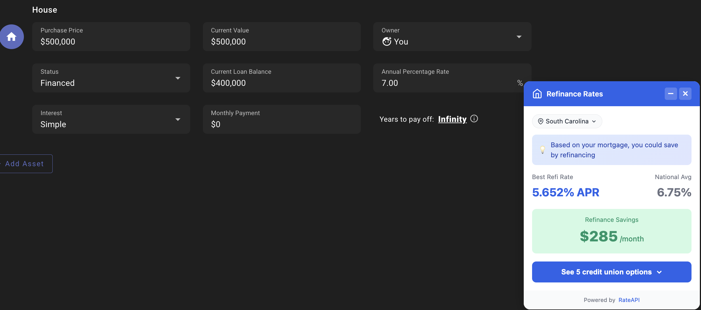

# RateAPI Chrome Extension - Developer Demo

**Example implementation showing real-time mortgage rate integration using the RateAPI Decision Engine**

This is a **developer demo** showcasing how to integrate RateAPI's mortgage rate data into real estate and financial planning websites. The extension serves as working example code demonstrating API integration patterns, DOM extraction techniques, and Shadow DOM UI components that developers can learn from or fork for their own applications.

**Target Audience:** Developers and product teams evaluating RateAPI for their applications.

**This is example code, not a product.** This extension demonstrates RateAPI integration patterns for developers. It's meant to be forked, studied, and adapted for your own applications.

**What You'll Learn:**
- How to call RateAPI's Decision Engine API
- Real-world DOM extraction patterns for fintech sites
- Chrome Extension Manifest V3 architecture
- Shadow DOM for style-isolated UI components
- Client-side API proxy patterns
- SPA navigation handling in content scripts

**Get Started:** Get your free RateAPI key at [https://rateapi.dev](https://rateapi.dev) and start building.

## Demo Screenshots - API Integration Examples

These screenshots show the extension in action across different contexts, demonstrating various API integration patterns:

| Context | Site | API Usage Pattern |
|---------|------|-------------------|
| **Refinance** | ProjectionLab | `intent: refinance` + current rate comparison |
| **Purchase** | Zillow | `intent: purchase` + list price extraction |
| **Purchase** | Redfin | `intent: purchase` + state from URL parsing |

### ProjectionLab - Refinance API Pattern

*Demonstrates: refinance intent, current rate extraction, persistent state storage*

### Zillow - Purchase API Pattern

*Demonstrates: price extraction from React components, state from URL parsing*

### Redfin - Purchase API Pattern

*Demonstrates: handling SPA navigation, multiple selector fallbacks*

## What You Can Build With This

This demo shows you how to integrate RateAPI into various applications. Use this code as a starting point for:

**Real Estate & Mortgage Apps:**
- Property listing sites with embedded rate comparisons
- Affordability calculators with real-time credit union rates
- Realtor tools for client consultations
- Home buyer education platforms

**Financial Planning & Refinance:**
- Refinance recommendation engines
- Mortgage optimization tools in financial dashboards
- Net worth tracking apps with loan optimization
- Retirement planning with housing cost scenarios

**Rate Comparison & Lead Gen:**
- Credit union rate aggregator sites
- Mortgage shopping marketplaces
- Financial advisor tools
- Lead generation with personalized rate quotes

**Browser Extensions & Widgets:**
- Custom extensions for specific niches (luxury, commercial, etc.)
- Embeddable rate widgets for blogs and content sites
- Rate alert and monitoring tools
- Portfolio management extensions

## Developer Integration Guides

- **[Real Estate Sites Integration](./REAL_ESTATE_INTEGRATIONS.md)** - Technical patterns for Zillow, Redfin, Realtor.com
- **[ProjectionLab Integration](./PROJECTIONLAB_INTEGRATION.md)** - Refinance context implementation details

## What This Demo Showcases

**API Integration Patterns:**
- Calling RateAPI's Decision Engine with different contexts (purchase vs. refinance)
- Handling API responses and transforming data for UI display
- Client-side caching strategies (1-hour TTL)
- Mock data fallbacks for development

**DOM Extraction Techniques:**
- Site-specific selector strategies with fallback chains
- State detection from URLs vs. DOM elements
- Handling dynamic content and SPA routing
- Working with React/Vue component rendering

**Chrome Extension Architecture:**
- Manifest V3 service worker patterns
- MAIN world vs. ISOLATED world content scripts
- Shadow DOM for style isolation
- Message passing between extension contexts

**UI Component Patterns:**
- Lit web components with reactive properties
- Loading, error, and data states
- Minimizable, non-intrusive overlays
- Responsive design without framework dependencies

## Supported Sites (Demo Integrations)

| Site | URL Pattern | Context | What It Demonstrates |
|------|-------------|---------|----------------------|
| **Zillow** | `zillow.com/homedetails/*` | Purchase | React component extraction, URL parsing |
| **Redfin** | `redfin.com/*/home/*` | Purchase | SPA navigation, selector fallbacks |
| **Realtor.com** | `realtor.com/realestateandhomes-detail/*` | Purchase | Breadcrumb parsing, dynamic content |
| **ProjectionLab** | `app.projectionlab.com/*` | Refinance | Vuetify forms, refinance API pattern |

These are **example integrations** showing different technical patterns. Fork the code and adapt for your own use case.

### ProjectionLab Integration - Refinance API Pattern

This integration demonstrates how to implement **refinance-specific** API calls, contrasting with the purchase-focused real estate site patterns.

**Key Technical Differences:**

```javascript
// Purchase context (Zillow/Redfin)
{
  product_request: {
    intent: "purchase",
    amount: listPrice  // from listing
  }
}

// Refinance context (ProjectionLab)
{
  product_request: {
    intent: "refinance",
    amount: currentBalance  // from existing loan
  }
}
```

**What Developers Can Learn:**
- Extracting data from Vuetify form components
- Persistent storage with chrome.storage API
- Handling missing data gracefully (state selection fallback)
- Calculating savings against current rate vs. national average
- Working with financial planning SPA architectures

**Implementation Details:** [PROJECTIONLAB_INTEGRATION.md](./PROJECTIONLAB_INTEGRATION.md)

## Quick Start for Developers

### Option 1: Using run.js (Recommended)

From the repo root:

```bash
# Build extension and start proxy server
node run.js chrome-extension

# Then load in Chrome:
# 1. Open chrome://extensions
# 2. Enable "Developer mode" (top right)
# 3. Click "Load unpacked"
# 4. Select the chrome-extension folder
# 5. Visit any property listing on Zillow, Redfin, or Realtor.com
```

The proxy server runs at `http://localhost:3000` and demonstrates how to proxy RateAPI calls safely.

**To test with live RateAPI data**, add your API key to the root `.env`:
```bash
# In rateapi-demos/.env
RATEAPI_KEY=your-api-key-here
```

**Get your API key:** Sign up at [https://rateapi.dev](https://rateapi.dev) for free access to the Decision Engine.

Or run the rate-explorer demo first to auto-create an API key:
```bash
node run.js rate-explorer
```

### Option 2: Manual Setup

```bash
cd chrome-extension
npm install
npm run dev  # Builds extension and starts proxy server
```

### Option 3: Extension Only (No Server)

The extension also works without the proxy server, falling back to built-in mock data:

```bash
cd chrome-extension
npm install
npm run build
# Load in Chrome and visit a property listing
```

You should see a floating overlay showing credit union rates when you visit a property listing on Zillow, Redfin, or Realtor.com.

## Development

### Watch Mode

Automatically rebuild on file changes:

```bash
npm run watch
```

After making code changes:
1. Save your files
2. Go to `chrome://extensions`
3. Click the refresh icon on the extension card
4. Reload any property listing pages to see changes

### Project Structure - Code Tour for Developers

```
chrome-extension/
├── manifest.json              # Chrome Manifest V3 configuration
├── package.json               # Dependencies (Lit, esbuild)
├── esbuild.config.js          # Build configuration
│
├── src/
│   ├── background.js          # ⭐ START HERE: API calls, caching, message handling
│   │
│   ├── content/
│   │   ├── index.js           # Site detection, DOM extraction, overlay injection
│   │   ├── bridge.js          # ISOLATED world script (chrome API bridge)
│   │   └── components/
│   │       └── rate-overlay.js  # ⭐ Lit component: UI states, Shadow DOM patterns
│   │
│   ├── lib/
│   │   ├── config.js          # Extension configuration (API URLs, timeouts)
│   │   └── sites.js           # ⭐ Site configs: selector patterns, state extraction
│   │
│   ├── styles/
│   │   └── overlay.css        # Global styles (minimal, Shadow DOM does most)
│   │
│   └── popup/
│       ├── popup.html         # Extension popup UI
│       └── popup.js           # Popup logic (cache clearing, state reset)
│
├── server.js                  # ⭐ Local proxy server: API key protection pattern
├── icons/                     # Extension icons (16, 48, 128)
└── dist/                      # Built output (load this in Chrome)
```

**Start Your Code Review Here:**

1. `src/lib/sites.js` - See how DOM extraction is configured per site
2. `src/background.js` - Understand the API call and caching pattern
3. `src/content/components/rate-overlay.js` - Study the Lit component structure
4. `server.js` - Review the API proxy pattern for development

### Architecture

The extension uses a **three-tier architecture** to work around Chrome's content script isolation:

```
┌─────────────────────────────────────────────────────┐
│  Background Service Worker (background.js)          │
│  - Handles API calls to proxy server                │
│  - In-memory rate caching (1 hour TTL)              │
│  - Provides mock data for demo mode                 │
└──────────────────┬──────────────────────────────────┘
                   │ chrome.runtime.sendMessage()
                   │
┌──────────────────▼──────────────────────────────────┐
│  Bridge Script (bridge.js) - ISOLATED World         │
│  - Access to chrome.* APIs                          │
│  - Bridges MAIN world ↔ background worker           │
│  - Uses window.postMessage for communication        │
└──────────────────┬──────────────────────────────────┘
                   │ window.postMessage()
                   │
┌──────────────────▼──────────────────────────────────┐
│  Content Script (index.js) - MAIN World             │
│  - Site detection (Zillow/Redfin/Realtor)           │
│  - Price/state extraction from page DOM             │
│  - Overlay component injection                      │
│  - SPA navigation handling                          │
└──────────────────┬──────────────────────────────────┘
                   │ customElements.define()
                   │
┌──────────────────▼──────────────────────────────────┐
│  Rate Overlay (rate-overlay.js) - Lit Component     │
│  - Shadow DOM for style isolation                   │
│  - Loading/error/data states                        │
│  - Minimize/expand/close controls                   │
│  - Rate comparison display                          │
└─────────────────────────────────────────────────────┘
```

**Why Two Content Scripts?**

Chrome Manifest V3 requires content scripts to run in an ISOLATED world for security. However, Lit components need to run in the MAIN world to access the page's `customElements` API. The bridge script acts as a messenger between these two isolated contexts.

### How Site Detection Works

Each supported site has a configuration in `src/lib/sites.js`:

```javascript
{
  name: 'Zillow',
  hostPattern: /zillow\.com/,
  pathPattern: /\/homedetails\//,
  priceSelectors: ['[data-testid="price"]', '.ds-value', ...],
  getState(doc) { /* extraction logic */ },
  anchorSelector: '[data-testid="price"]'
}
```

The content script:
1. Matches current URL against `hostPattern` and `pathPattern`
2. Waits for page to settle (async content loading)
3. Tries each `priceSelector` until it finds a valid price
4. Calls `getState()` to extract state from URL or DOM
5. Injects overlay near `anchorSelector` element

### How API Communication Works

```javascript
// Content script (MAIN world)
const data = await sendMessage('getRates', { state: 'CA', amount: 500000 });

// ↓ window.postMessage()

// Bridge script (ISOLATED world)
const response = await chrome.runtime.sendMessage({ action: 'getRates', ... });

// ↓ chrome.runtime.sendMessage()

// Background worker
const rateData = await fetchRates(state, amount);  // Calls proxy or returns mock
```

## Local Proxy Server

The included Express server (`server.js`) proxies requests to RateAPI:

```bash
# Start with demo data (no API key needed)
npm run server

# Start with live RateAPI data
RATEAPI_KEY=your-key npm run server
```

**Endpoints:**
| Endpoint | Method | Description |
|----------|--------|-------------|
| `/rates` | POST | Get mortgage rates for state/amount |
| `/health` | GET | Server health check |

**Request:**
```bash
curl -X POST http://localhost:3000/rates \
  -H "Content-Type: application/json" \
  -d '{"state": "CA", "amount": 500000}'
```

**Response:**
```json
{
  "bestRate": 6.125,
  "avgRate": 6.75,
  "monthlySavings": 127,
  "topOffers": [
    {
      "credit_union_name": "State Employees Credit Union",
      "apr": 6.125,
      "monthly_payment": 3035,
      "state": "CA"
    }
  ],
  "isMockData": true
}
```

---

## Production Setup

For **production deployments**, deploy a Cloudflare Worker proxy to protect your API key.

### Step 1: Create Cloudflare Worker

Deploy this code to Cloudflare Workers:

```javascript
export default {
  async fetch(request, env) {
    // CORS preflight
    if (request.method === 'OPTIONS') {
      return new Response(null, {
        headers: {
          'Access-Control-Allow-Origin': request.headers.get('Origin') || '*',
          'Access-Control-Allow-Methods': 'POST, OPTIONS',
          'Access-Control-Allow-Headers': 'Content-Type',
        }
      });
    }

    // Validate origin (Chrome extension or localhost for dev)
    const origin = request.headers.get('Origin') || '';
    const isValidOrigin =
      origin.startsWith('chrome-extension://') ||
      origin.startsWith('http://localhost');

    if (!isValidOrigin) {
      return new Response('Forbidden', { status: 403 });
    }

    try {
      const { state, amount, termMonths } = await request.json();

      // Call RateAPI Decision Engine
      const response = await fetch('https://api.rateapi.dev/v1/decisions', {
        method: 'POST',
        headers: {
          'Content-Type': 'application/json',
          'X-API-Key': env.RATEAPI_KEY,
        },
        body: JSON.stringify({
          decision_type: 'financing',
          context: {
            request_id: `cf-worker-${Date.now()}`,
            geo: { state },
          },
          product_request: {
            product_type: 'mortgage',
            intent: 'purchase',
            amount: amount,
            term_months: termMonths || 360,
          },
          preferences: {
            max_providers: 5,
          },
        }),
      });

      const data = await response.json();

      // Transform API response to extension format
      const offers = data.actions?.[0]?.offers || [];
      const bestRate = offers[0]?.apr || 0;
      const avgRate = 6.75; // National average for comparison

      return Response.json({
        bestRate,
        avgRate,
        monthlySavings: data.summary?.estimated_savings?.monthly || 0,
        topOffers: offers.slice(0, 5).map(offer => ({
          credit_union_name: offer.credit_union_name,
          apr: offer.apr,
          monthly_payment: offer.monthly_payment,
          state: state,
        })),
      }, {
        headers: {
          'Access-Control-Allow-Origin': origin,
          'Access-Control-Allow-Methods': 'POST, OPTIONS',
          'Access-Control-Allow-Headers': 'Content-Type',
        }
      });
    } catch (error) {
      return Response.json({
        error: error.message
      }, {
        status: 500,
        headers: {
          'Access-Control-Allow-Origin': origin,
        }
      });
    }
  }
};
```

### Step 2: Configure Worker Secrets

```bash
# Install Wrangler (if not already installed)
npm install -g wrangler

# Add your RateAPI key as a secret
wrangler secret put RATEAPI_KEY
# Enter your RateAPI key when prompted
```

### Step 3: Deploy Worker

```bash
wrangler deploy
# Note the deployed URL (e.g., https://rateapi-proxy.your-subdomain.workers.dev)
```

### Step 4: Update Extension Config

Edit `src/lib/config.js`:

```javascript
export const CONFIG = {
  PROXY_URL: 'https://rateapi-proxy.your-subdomain.workers.dev',
  CACHE_TTL: 3600,
  NATIONAL_AVG_RATE: 6.75,
  DEFAULT_TERM_MONTHS: 360,
  OVERLAY_DELAY: 1500,
};
```

### Step 5: Rebuild Extension

```bash
npm run build
```

Reload the extension in `chrome://extensions` and visit a property listing to see live rate data.

## RateAPI Integration - Decision Engine

This demo uses RateAPI's **Decision Engine** endpoint to fetch real-time mortgage rates. Here's how to integrate it in your own application:

### Endpoint

```
POST https://api.rateapi.dev/v1/decisions
```

### Authentication

```bash
X-API-Key: your-api-key-here
```

Get your free API key at [https://rateapi.dev](https://rateapi.dev)

### Request Example

```json
{
  "decision_type": "financing",
  "context": {
    "request_id": "your-app-request-123",
    "geo": { "state": "CA" }
  },
  "product_request": {
    "product_type": "mortgage",
    "intent": "purchase",        // or "refinance"
    "amount": 500000,
    "term_months": 360           // 30-year fixed
  },
  "preferences": {
    "max_providers": 5           // limit results
  }
}
```

### Response Structure

```json
{
  "summary": {
    "recommended_action": "shop_providers",
    "confidence": 0.92,
    "estimated_savings": {
      "monthly": 127,
      "total": 45720
    }
  },
  "actions": [{
    "offers": [
      {
        "rank": 1,
        "credit_union_name": "State Employees Credit Union",
        "product_name": "30-Year Fixed",
        "apr": 6.125,
        "monthly_payment": 3035,
        "estimated_monthly_savings": 127,
        "credit_union_slug": "state-employees-cu"
      }
    ]
  }]
}
```

### Implementation in This Demo

See `chrome-extension/src/background.js` for the full implementation:

```javascript
// Simplified example from background.js
async function fetchRates(state, amount, intent = 'purchase') {
  const response = await fetch('https://api.rateapi.dev/v1/decisions', {
    method: 'POST',
    headers: {
      'Content-Type': 'application/json',
      'X-API-Key': env.RATEAPI_KEY,
    },
    body: JSON.stringify({
      decision_type: 'financing',
      context: { geo: { state } },
      product_request: {
        product_type: 'mortgage',
        intent,
        amount,
        term_months: 360,
      },
      preferences: { max_providers: 5 },
    }),
  });

  const data = await response.json();
  return transformToOverlayFormat(data);
}
```

**Learn More:** [RateAPI Documentation](https://docs.rateapi.dev/decision-engine)

## Tech Stack & Architecture Decisions

| Technology | Purpose | Why We Chose It |
|------------|---------|-----------------|
| **Lit** | Web Components | Lightweight (5kb), native Shadow DOM, no virtual DOM overhead |
| **esbuild** | Bundler | Fast builds, simple config, TypeScript support |
| **Shadow DOM** | Style isolation | Prevents style conflicts with host pages |
| **Chrome Manifest V3** | Extension API | Latest Chrome extension standard |

### Why This Stack?

**Lit over React/Vue:**
- 5kb vs 40kb+ for React (better for extensions)
- Native Shadow DOM support without polyfills
- Works seamlessly with customElements API
- No virtual DOM overhead for simple UI

**Shadow DOM Benefits:**
- Complete style isolation from host page
- No CSS conflicts with Zillow, Redfin, etc.
- Encapsulated component logic
- Standard web platform feature

**Manifest V3:**
- Required for new Chrome extensions
- Better security model
- Service worker architecture
- Future-proof

**Takeaway for Developers:** This stack prioritizes small bundle size and style isolation, critical for content script injections. Adapt based on your needs (e.g., React if you're already using it elsewhere).

## Customization

### Styling the Overlay

The overlay component uses CSS custom properties for theming. Edit `src/content/components/rate-overlay.js`:

```javascript
static styles = css`
  :host {
    --rateapi-brand: #2563eb;        /* Primary color */
    --rateapi-success: #059669;      /* Savings color */
    --rateapi-surface: #ffffff;      /* Background */
    --rateapi-radius: 12px;          /* Border radius */
    --rateapi-shadow: 0 4px 24px rgba(0, 0, 0, 0.12);
  }
  // ...
`;
```

### Adding New Sites

To support additional real estate sites, add a configuration to `src/lib/sites.js`:

```javascript
export const SITES = {
  // Existing sites...

  newsite: {
    name: 'New Site',
    hostPattern: /newsite\.com/,
    pathPattern: /\/property\//,

    // Price selectors (try in order)
    priceSelectors: ['.listing-price', '.price-value'],

    // State extraction logic
    getState(doc) {
      const match = window.location.pathname.match(/\/([A-Z]{2})\//);
      return match ? match[1] : null;
    },

    // Where to position overlay
    anchorSelector: '.listing-price',
  },
};
```

Then update `manifest.json` to include the new site:

```json
{
  "content_scripts": [
    {
      "matches": [
        "https://*.zillow.com/homedetails/*",
        "https://*.redfin.com/*/home/*",
        "https://*.realtor.com/realestateandhomes-detail/*",
        "https://*.newsite.com/property/*"
      ],
      // ...
    }
  ]
}
```

### Changing Cache Duration

Edit `src/lib/config.js`:

```javascript
export const CONFIG = {
  CACHE_TTL: 1800, // 30 minutes (in seconds)
  // ...
};
```

## Troubleshooting

### Overlay doesn't appear

**Symptoms:** No rate overlay shows on property listings

**Solutions:**
1. Verify you're on a property **detail page**, not search results
2. Open DevTools Console (F12) and look for `[RateAPI]` logs
3. Check that the extension is enabled in `chrome://extensions`
4. Try refreshing the page (some sites use lazy loading)
5. Verify the site is supported (Zillow/Redfin/Realtor detail pages only)

### "Demo Mode" badge showing

**Symptoms:** Extension displays sample data with a yellow "Demo Mode" badge

**Explanation:** This is expected behavior when the proxy isn't configured. The extension falls back to realistic mock data for demonstration purposes.

**To use live data:** Follow the [Production Setup](#production-setup) guide above.

### Rate data seems stale

**Symptoms:** Rates don't update when revisiting the same property

**Solution:**
1. Click the extension icon (top-right toolbar)
2. Select "Clear Cached Rates"
3. Refresh the property page

Rates are cached for 1 hour to reduce API calls and improve performance.

### Extension doesn't load after updates

**Symptoms:** Changes don't appear after rebuilding

**Solution:**
1. Go to `chrome://extensions`
2. Find "RateAPI - Credit Union Rate Checker"
3. Click the refresh icon (circular arrow)
4. Reload any open property listing pages

### Console errors about customElements

**Symptoms:** `customElements is not defined` errors in console

**Explanation:** The extension is configured to run content scripts in the MAIN world (not ISOLATED), which should have access to customElements. This error suggests a configuration issue.

**Solution:**
1. Verify `manifest.json` has `"world": "MAIN"` for the content script
2. Check that you're using the built `dist/content.js`, not the source file
3. Rebuild the extension: `npm run build`

### CORS errors in DevTools

**Symptoms:** Console shows CORS policy errors when fetching rates

**Explanation:** The Cloudflare Worker proxy must include proper CORS headers for Chrome extension origins.

**Solution:** Verify your proxy includes:
```javascript
'Access-Control-Allow-Origin': request.headers.get('Origin')
```

The origin will be something like `chrome-extension://abcdefghijklmnop`.

## Build Your Own

This demo is designed to be forked and customized for your own use case. Here are some ideas:

### Adaptation Ideas

**Real Estate Applications:**
- Add your own mortgage calculator with RateAPI data
- Integrate with your own lead generation system
- Create a realtor-facing tool for client consultations
- Build a mobile app version using the same API patterns

**Financial Planning:**
- Extend to other loan types (auto, personal, HELOC)
- Add rate tracking and alerts
- Build a refinance recommendation engine
- Create a mortgage payoff optimizer

**Rate Comparison Sites:**
- Build a credit union rate aggregator
- Add user accounts and saved searches
- Implement rate change notifications
- Create API-powered widgets for blogs

### Customization Starting Points

1. **Change the UI:** Edit `src/content/components/rate-overlay.js` (Lit component)
2. **Add new sites:** Update `src/lib/sites.js` with new extraction patterns
3. **Modify API calls:** Edit `src/background.js` to change request parameters
4. **Deploy your own proxy:** Use the included Cloudflare Worker template

### Production Deployment

If you want to publish your own version:

1. Get your own RateAPI key at [https://rateapi.dev](https://rateapi.dev)
2. Deploy the proxy worker to Cloudflare (see Production Setup section)
3. Update branding in manifest.json and icons
4. Consider Chrome Web Store publishing if targeting end users

**Need Help?** Open an issue in this repo or email support@rateapi.dev

## Performance

The extension is optimized for minimal impact:

- **Bundle size:** ~15kb total (content + background scripts)
- **Memory:** ~2-5MB (including cached rate data)
- **Network:** 1 API call per property (cached for 1 hour)
- **CPU:** Negligible (event-driven architecture)

## Security Considerations

- **API Key Protection:** Never embed API keys in extension code. Always use a proxy server.
- **Content Security Policy:** The extension follows Chrome's recommended CSP.
- **Origin Validation:** Proxy server validates requests come from the extension.
- **Shadow DOM Isolation:** Prevents host page scripts from accessing extension UI.
- **Minimal Permissions:** Only requests `storage` and `activeTab` permissions.

## License

MIT License - see [LICENSE](../LICENSE) for details.

## Resources

- [RateAPI Documentation](https://rateapi.dev)
- [Chrome Extension Docs](https://developer.chrome.com/docs/extensions/)
- [Lit Documentation](https://lit.dev)
- [Cloudflare Workers](https://workers.cloudflare.com)

## Contributing & Support

This is open source example code in the RateAPI demos repository. Contributions welcome!

**For Developers:**
- Questions about the code? [Open an issue](https://github.com/rate-api/demos/issues)
- Want to improve the demo? [Submit a PR](https://github.com/rate-api/demos/pulls)
- Building something similar? Share it! We'd love to see what you create

**For API Support:**
- RateAPI questions: [Email support@rateapi.dev](mailto:support@rateapi.dev)
- API documentation and signup: [https://rateapi.dev](https://rateapi.dev)

## About This Demo

This Chrome extension is part of the **RateAPI Demos** repository, showcasing practical implementations of the RateAPI Decision Engine. It's designed as a learning resource and starting point for developers building fintech applications.

**Not for end users:** This is example code for developers, not a consumer product. If you're looking to compare mortgage rates, visit [RateAPI.dev](https://rateapi.dev) directly.
