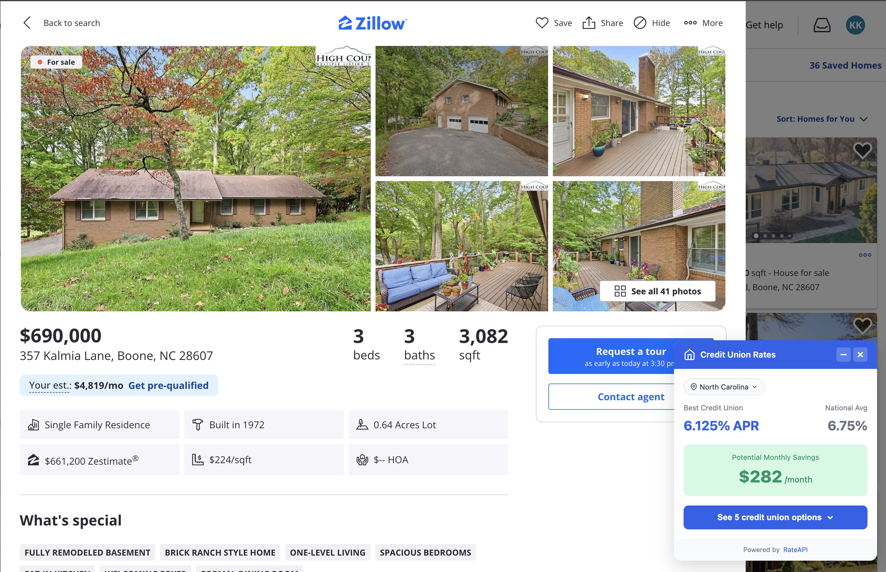
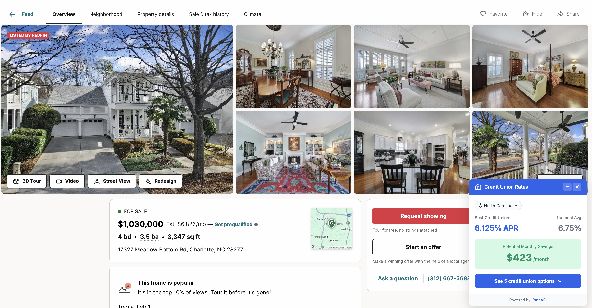

# Real Estate Site Integrations - Developer Implementation Guide

**Reference implementations for integrating RateAPI mortgage rates into real estate platforms**

## Demo Screenshots

### Zillow Integration Pattern

*Demonstrates: React component price extraction, URL state parsing, 20% down payment calculation*

### Redfin Integration Pattern

*Demonstrates: SPA navigation handling, alternative selector fallbacks, dynamic content detection*

## Overview

These integrations showcase **purchase-focused mortgage rate lookups** for real estate applications. The code demonstrates DOM extraction patterns, API integration, and UI overlay techniques that developers can adapt for their own real estate or mortgage comparison tools.

**What You'll Learn:**
- Site-specific DOM extraction strategies
- Handling SPA routing and dynamic content
- Multiple selector fallback patterns
- State extraction from URLs vs. DOM
- Shadow DOM overlays that don't conflict with host site styles
- API request patterns for purchase context

## Supported Sites

| Site | URL Pattern | What's Extracted |
|------|-------------|------------------|
| **Zillow** | `zillow.com/homedetails/*` | Price, state from URL/address |
| **Redfin** | `redfin.com/*/home/*` | Price, state from URL path |
| **Realtor.com** | `realtor.com/realestateandhomes-detail/*` | Price, state from URL/breadcrumbs |

## How the Integration Works

### Technical Flow

When a developer loads the extension on a property detail page:

1. **Site Detection** - URL pattern matching against configured sites
2. **Content Wait** - Delays 1.5s for React/Vue components to render
3. **Price Extraction** - Tries multiple CSS selectors in priority order
4. **State Extraction** - Parses URL or DOM for state abbreviation
5. **API Call** - Requests rates from RateAPI with purchase intent
6. **Overlay Injection** - Shadow DOM component displays results

This demonstrates a complete content script integration pattern that developers can adapt for their own applications.

### 2. Site-Specific Extraction

Each site has custom selectors because they all structure their DOM differently:

**Zillow:**
```javascript
priceSelectors: [
  '[data-testid="price"] span',
  '.ds-summary-row .ds-value',
  '.price'
]
// State from URL: /homedetails/123-main-st-austin-tx-78701/
```

**Redfin:**
```javascript
priceSelectors: [
  '.statsValue',
  '.price',
  '[data-rf-test-id="abp-price"]'
]
// State from URL: /CA/San-Francisco/123-Main-St/home/12345
```

**Realtor.com:**
```javascript
priceSelectors: [
  '[data-testid="list-price"]',
  '.price-details',
  '.listing-price'
]
// State from URL: /realestateandhomes-detail/123-Main-St_Austin_TX_78701
```

### 3. State Selection

The extension uses multiple strategies to determine your location:

**Priority 1: URL Parsing**
- Zillow: Extracts state from `-tx-78701` pattern in URL
- Redfin: Extracts state from `/TX/` path segment
- Realtor: Extracts state from `_TX_` pattern in URL

**Priority 2: DOM Extraction**
- Searches address elements for state abbreviation
- Falls back to breadcrumbs if available

**Priority 3: User Selection**
- If state can't be auto-detected, shows a dropdown
- Selection is saved to Chrome storage for future visits

## The Overlay

The overlay displays:

1. **Best Credit Union Rate** - Lowest APR available in your state
2. **National Average** - Current national average for comparison (6.75%)
3. **Monthly Savings** - Calculated difference in monthly payment
4. **5 Credit Union Options** - Expandable list of top offers

### Overlay Controls

- **Minimize** - Collapse to small "Save $X/mo" badge
- **Expand** - Click "See 5 credit union options" to view all offers
- **Close** - Dismiss the overlay entirely
- **Change State** - Click state badge to select different location

## Savings Examples

Based on real rate data:

| Home Price | Location | Best CU Rate | National Avg | Monthly Savings |
|------------|----------|--------------|--------------|-----------------|
| $690,000 | NC | 5.00% | 6.75% | **$771/mo** |
| $1,030,000 | NC | 5.00% | 6.75% | **$1,152/mo** |
| $500,000 | CA | 5.65% | 6.75% | **$359/mo** |
| $400,000 | TX | 5.50% | 6.75% | **$312/mo** |

*Savings calculated on 30-year fixed mortgage, 20% down payment assumed*

## RateAPI Data: Credit Union Focus

RateAPI specializes in credit union mortgage rates, which typically run **0.25-0.75% lower** than traditional banks. This creates compelling savings comparisons in the UI:

```javascript
// Example: $500,000 mortgage comparison
const bankRate = 6.75;      // National average
const creditUnionRate = 6.00; // RateAPI best rate
const monthlySavings = 150;  // Calculated difference

// Displays well in UI:
"Save $150/mo with credit union financing"
"$54,000 total savings over 30 years"
```

This makes for effective conversion-focused messaging in real estate or mortgage applications.

## Technical Details

### Content Script Architecture

The extension uses a three-tier architecture:

```
┌─────────────────────────────────────────────────┐
│  Background Service Worker                       │
│  - API calls via proxy server                    │
│  - In-memory caching (1 hour TTL)               │
│  - Mock data fallback for demo mode             │
└──────────────────┬──────────────────────────────┘
                   │ chrome.runtime.sendMessage()
┌──────────────────▼──────────────────────────────┐
│  Bridge Script (ISOLATED World)                  │
│  - Access to chrome.* APIs                       │
│  - Forwards messages to background              │
└──────────────────┬──────────────────────────────┘
                   │ window.postMessage()
┌──────────────────▼──────────────────────────────┐
│  Content Script (MAIN World)                     │
│  - Site detection and DOM extraction            │
│  - Lit component injection                      │
│  - SPA navigation handling                      │
└─────────────────────────────────────────────────┘
```

### SPA Navigation Handling

Real estate sites use client-side routing, so the extension polls for URL changes:

```javascript
setInterval(() => {
  if (location.href !== lastUrl) {
    lastUrl = location.href;
    // Clean up existing overlay
    // Re-run detection
  }
}, 1000);
```

### Shadow DOM Isolation

The overlay uses Shadow DOM to prevent style conflicts with host pages:

```javascript
class RateOverlay extends LitElement {
  static styles = css`
    :host {
      --rateapi-brand: #2563eb;
      // Isolated styles that won't leak
    }
  `;
}
```

## Adding Your Own Site Integrations

### Configuration Pattern

To adapt this code for your own real estate site, update `src/lib/sites.js`:

```javascript
export const SITES = {
  yoursite: {
    name: 'Your Real Estate Site',
    hostPattern: /yoursite\.com/,
    pathPattern: /\/property\//,

    // Try selectors in order until one works
    priceSelectors: [
      '.listing-price',
      '[data-testid="price"]',
      '.price-value'
    ],

    // Extract state from URL or DOM
    getState(doc) {
      // Option 1: From URL pattern
      const urlMatch = window.location.pathname.match(/\/([A-Z]{2})\//);
      if (urlMatch) return urlMatch[1];

      // Option 2: From address element
      const address = doc.querySelector('.property-address')?.textContent;
      const stateMatch = address?.match(/,\s*([A-Z]{2})\s+\d{5}/);
      return stateMatch ? stateMatch[1] : null;
    },

    // Where to position the overlay
    anchorSelector: '.listing-price',
  },
};
```

Then update `manifest.json` to include your URL patterns:

```json
{
  "content_scripts": [{
    "matches": [
      "https://*.yoursite.com/property/*"
    ]
  }]
}
```

### Testing Your Integration

1. Add your site config to `sites.js`
2. Update manifest.json
3. Run `npm run build`
4. Reload extension in `chrome://extensions`
5. Check DevTools console for `[RateAPI]` logs showing extraction results

## Troubleshooting

### Overlay doesn't appear

1. **Verify you're on a detail page** - Not search results
2. **Check the console** - Filter for `[RateAPI]` logs
3. **Wait for page load** - Extension waits 1.5s for dynamic content
4. **Refresh the extension** - Go to `chrome://extensions` and click refresh

### Wrong state detected

1. Click the state badge in the overlay
2. Select your correct state from the dropdown
3. State will be saved for future visits

### Stale rate data

1. Click the extension icon in toolbar
2. Select "Clear Cached Rates"
3. Refresh the property page

## Use Cases for Developers

### Building Your Own Integration

This code can be adapted for:

**Real Estate Platforms:**
- Add mortgage rate widgets to your property listings
- Build a realtor-facing tool for client presentations
- Create affordability calculators with real-time rates

**Mortgage Comparison Sites:**
- Aggregate credit union rates from RateAPI
- Build location-aware rate comparators
- Create lead generation tools with rate data

**Financial Planning Apps:**
- Add home purchase affordability checks
- Compare purchase vs. rent with real mortgage rates
- Build scenario modeling tools

**Browser Extensions:**
- Fork this code for your own niche (e.g., luxury real estate, commercial)
- Add rate tracking and alerts
- Create portfolio-focused mortgage tools

### API Integration Patterns

This demo shows three key patterns:

1. **Client-side proxy** (`server.js`) - Protects API keys in development
2. **Cloudflare Worker proxy** (production) - Serverless rate lookups
3. **Mock data fallback** - Works without API for testing

Choose the pattern that fits your architecture.

## Developer Resources

- [Chrome Extension README](./README.md) - Full setup and architecture guide
- [ProjectionLab Integration](./PROJECTIONLAB_INTEGRATION.md) - Refinance pattern examples
- [RateAPI Documentation and Signup](https://rateapi.dev) - API reference and access
- [Demo Repository](https://github.com/rate-api/demos) - Full source code

---

**Part of RateAPI Demos** - Open source examples for developers building mortgage and fintech applications
